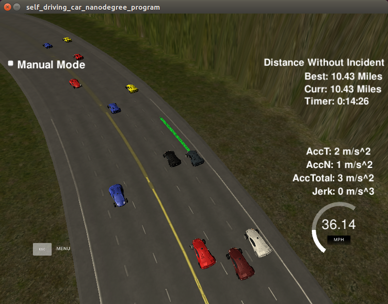

# CarND-Path-Planning-Project
Self-Driving Car Engineer Nanodegree Program
   


## Compile and run the path_planning

My Path-Planning works with the following process on the repository root.

```
	$ mkdir build
	$ cd ./build
    $ cmake ..
-- The C compiler identification is GNU 5.4.0
-- The CXX compiler identification is GNU 5.4.0
-- Check for working C compiler: /usr/bin/cc
-- Check for working C compiler: /usr/bin/cc -- works
-- Detecting C compiler ABI info
-- Detecting C compiler ABI info - done
-- Detecting C compile features
-- Detecting C compile features - done
-- Check for working CXX compiler: /usr/bin/c++
-- Check for working CXX compiler: /usr/bin/c++ -- works
-- Detecting CXX compiler ABI info
-- Detecting CXX compiler ABI info - done
-- Detecting CXX compile features
-- Detecting CXX compile features - done
-- Configuring done
-- Generating done
-- Build files have been written to: (snip) /CarND-Path-Planning-Project/build
    $ make
[ 50%] Linking CXX executable path_planning
[100%] Built target path_planning
    $ ./path_planning
Listening to port 4567

```

## Rubric Points

### Compilation

#### The code compiles correctly.

No changes needs in the CMakeLists.txt to build the binary correctly for the project.

### Valid Trajectories

#### The car is able to drive at least 4.32 miles without incident..

The path_planning works for 10 more miles without incidents.



#### The car drives according to the speed limit.

The car drives as fast as it can do without collisions, and never exceeds the limit speed 50mph.

#### Max Acceleration and Jerk are not Exceeded.

The car does not exceed a total acceleration of 10 m/s^2 and a jerk of 10 m/s^3.

#### Car does not have collisions.

The car drives without collisions with any of the other cars on the road.

#### The car stays in its lane, except for the time between changing lanes.

The car keeps to stay in its lane, 
except for the time to change its lane at situations as below.

#### The car is able to change lanes

The car changes lanes when its preceding car is slow and an adjacent lane is clear.

And plus, if all lanes is clear, the car move to the center lane.

### Reflection

#### There is a reflection on how to generate paths.

The generating path algorithm is described with my code as below.


## Algorithm and Code Explanations

My project is based on the one provided by Udacity,
and my path planning algorithm is coded at [src/main.cpp line 270](./src/main.cpp#L270) .

My algorithm consists of Prediction, Behavior and Trajectory part,
and can be tuned with 9 parameters.


### Prediction Part [line 279 to 406](./src/main.cpp#L279)

This part infers vacant spaces around the car,
and estimates "time to collision" if find adjacent cars running.

The sensor fusion data are converted to the Frenet System from global map positions,
assuming all the cars drive along the road with common-sense.
And the position data are corrected to exact car positions with lapse from previous trajectory.

Then the algorithm decides whether other cars are running adjacent lanes of the car.

Though the road has 3 lanes, this algorithm assumes there are 5 lanes to simplify Behavior code.
Here, No-existence of lane is treated as same as No-Vacancy for the car.

To infer vacant spaces,
time-base prediction and distance-base prediction are applied to ensure the prediction results.

Typically time-base prediction performs well,
and distance-base prediction works to assist it in some cases
that "time to collision" would have large error when relative-speed is near zero.


### Behavior [line 410 to 460](./scr/main.cpp#L410)

This part decides what to do next based on the result of the prediction.

The algorithm is quite simple as below.

- if the car has vacancy ahead
  - try to speed up till MAX_SPEED
  - if all the lanes are clear, move to the center lane
- else (no vacancy in front of the car)
  - if both side lanes are free, move to the lane which "time to collision" is larger than the another
  - else if left side lane is free, move to left lane
  - else if right side lane is free, move to right lane
  - else (no vacancy around the car), speed down to the speed of the preceding car

Speed controls have hysteresis to avoid useless and deadly-frequent speed change.

### Trajectory [line 465 to 562](./scr/main.cpp#L465)

The part make a trajectory for the car, based on the lesson codes from Udacity.

This code use the latest 2 points and 3 new points produced
by getXY() with a lane number to go that decided at Behavior part.

Then the trajectories is filled up till 50 points using spline.h provided Udacity.


### Parameters [line 218 to 228](./scr/main.cpp#L218)

The algorithm can be tuned with 9 parameters.


Following 4 parameters controls the speed of the car to fit in with the limitation of the challenge.

``` 
    const double MIN_ACCEL = 0.010;
    const double MAX_ACCEL = 0.224;
    const double MIN_SPEED = MAX_ACCEL * 5;
    const double MAX_SPEED = 49.7;
```

Following 5 parameters controls the Prediction algorithm.

```
    const double SAFETY_RANGE_FRONT = 10;
    const double SAFETY_RANGE_REAR = 10;
    const double SAFETY_TIME_RANGE0 = 1.7; // sec
    const double SAFETY_TIME_RANGE1 = 2.5; // sec
    const double SAFETY_TIME_RANGE2 = 3.0; // sec
```
Large values for the parameters make the car to have long distance from other cars,
and sequentially the cars rarely changes its lane.

These parameters should have large values for safety drive, 
but it coincidently causes frequent traffic jam.

So the parameter values at my final code was decided as short as possible after some practical test.


Behavior and Trajectory part have no parameters to tune.


## original README

### Simulator.
You can download the Term3 Simulator which contains the Path Planning Project from the [releases tab (https://github.com/udacity/self-driving-car-sim/releases).

### Goals
In this project your goal is to safely navigate around a virtual highway with other traffic that is driving +-10 MPH of the 50 MPH speed limit. You will be provided the car's localization and sensor fusion data, there is also a sparse map list of waypoints around the highway. The car should try to go as close as possible to the 50 MPH speed limit, which means passing slower traffic when possible, note that other cars will try to change lanes too. The car should avoid hitting other cars at all cost as well as driving inside of the marked road lanes at all times, unless going from one lane to another. The car should be able to make one complete loop around the 6946m highway. Since the car is trying to go 50 MPH, it should take a little over 5 minutes to complete 1 loop. Also the car should not experience total acceleration over 10 m/s^2 and jerk that is greater than 10 m/s^3.

#### The map of the highway is in data/highway_map.txt
Each waypoint in the list contains  [x,y,s,dx,dy] values. x and y are the waypoint's map coordinate position, the s value is the distance along the road to get to that waypoint in meters, the dx and dy values define the unit normal vector pointing outward of the highway loop.

The highway's waypoints loop around so the frenet s value, distance along the road, goes from 0 to 6945.554.

## Basic Build Instructions

1. Clone this repo.
2. Make a build directory: `mkdir build && cd build`
3. Compile: `cmake .. && make`
4. Run it: `./path_planning`.

Here is the data provided from the Simulator to the C++ Program

#### Main car's localization Data (No Noise)

["x"] The car's x position in map coordinates

["y"] The car's y position in map coordinates

["s"] The car's s position in frenet coordinates

["d"] The car's d position in frenet coordinates

["yaw"] The car's yaw angle in the map

["speed"] The car's speed in MPH

#### Previous path data given to the Planner

//Note: Return the previous list but with processed points removed, can be a nice tool to show how far along
the path has processed since last time. 

["previous_path_x"] The previous list of x points previously given to the simulator

["previous_path_y"] The previous list of y points previously given to the simulator

#### Previous path's end s and d values 

["end_path_s"] The previous list's last point's frenet s value

["end_path_d"] The previous list's last point's frenet d value

#### Sensor Fusion Data, a list of all other car's attributes on the same side of the road. (No Noise)

["sensor_fusion"] A 2d vector of cars and then that car's [car's unique ID, car's x position in map coordinates, car's y position in map coordinates, car's x velocity in m/s, car's y velocity in m/s, car's s position in frenet coordinates, car's d position in frenet coordinates. 

## Details

1. The car uses a perfect controller and will visit every (x,y) point it recieves in the list every .02 seconds. The units for the (x,y) points are in meters and the spacing of the points determines the speed of the car. The vector going from a point to the next point in the list dictates the angle of the car. Acceleration both in the tangential and normal directions is measured along with the jerk, the rate of change of total Acceleration. The (x,y) point paths that the planner recieves should not have a total acceleration that goes over 10 m/s^2, also the jerk should not go over 50 m/s^3. (NOTE: As this is BETA, these requirements might change. Also currently jerk is over a .02 second interval, it would probably be better to average total acceleration over 1 second and measure jerk from that.

2. There will be some latency between the simulator running and the path planner returning a path, with optimized code usually its not very long maybe just 1-3 time steps. During this delay the simulator will continue using points that it was last given, because of this its a good idea to store the last points you have used so you can have a smooth transition. previous_path_x, and previous_path_y can be helpful for this transition since they show the last points given to the simulator controller with the processed points already removed. You would either return a path that extends this previous path or make sure to create a new path that has a smooth transition with this last path.

## Tips

A really helpful resource for doing this project and creating smooth trajectories was using http://kluge.in-chemnitz.de/opensource/spline/, the spline function is in a single hearder file is really easy to use.

---

## Dependencies

* cmake >= 3.5
 * All OSes: [click here for installation instructions](https://cmake.org/install/)
* make >= 4.1
  * Linux: make is installed by default on most Linux distros
  * Mac: [install Xcode command line tools to get make](https://developer.apple.com/xcode/features/)
  * Windows: [Click here for installation instructions](http://gnuwin32.sourceforge.net/packages/make.htm)
* gcc/g++ >= 5.4
  * Linux: gcc / g++ is installed by default on most Linux distros
  * Mac: same deal as make - [install Xcode command line tools]((https://developer.apple.com/xcode/features/)
  * Windows: recommend using [MinGW](http://www.mingw.org/)
* [uWebSockets](https://github.com/uWebSockets/uWebSockets)
  * Run either `install-mac.sh` or `install-ubuntu.sh`.
  * If you install from source, checkout to commit `e94b6e1`, i.e.
    ```
    git clone https://github.com/uWebSockets/uWebSockets 
    cd uWebSockets
    git checkout e94b6e1
    ```

## Editor Settings

We've purposefully kept editor configuration files out of this repo in order to
keep it as simple and environment agnostic as possible. However, we recommend
using the following settings:

* indent using spaces
* set tab width to 2 spaces (keeps the matrices in source code aligned)

## Code Style

Please (do your best to) stick to [Google's C++ style guide](https://google.github.io/styleguide/cppguide.html).

## Project Instructions and Rubric

Note: regardless of the changes you make, your project must be buildable using
cmake and make!


## Call for IDE Profiles Pull Requests

Help your fellow students!

We decided to create Makefiles with cmake to keep this project as platform
agnostic as possible. Similarly, we omitted IDE profiles in order to ensure
that students don't feel pressured to use one IDE or another.

However! I'd love to help people get up and running with their IDEs of choice.
If you've created a profile for an IDE that you think other students would
appreciate, we'd love to have you add the requisite profile files and
instructions to ide_profiles/. For example if you wanted to add a VS Code
profile, you'd add:

* /ide_profiles/vscode/.vscode
* /ide_profiles/vscode/README.md

The README should explain what the profile does, how to take advantage of it,
and how to install it.

Frankly, I've never been involved in a project with multiple IDE profiles
before. I believe the best way to handle this would be to keep them out of the
repo root to avoid clutter. My expectation is that most profiles will include
instructions to copy files to a new location to get picked up by the IDE, but
that's just a guess.

One last note here: regardless of the IDE used, every submitted project must
still be compilable with cmake and make./

## How to write a README
A well written README file can enhance your project and portfolio.  Develop your abilities to create professional README files by completing [this free course](https://www.udacity.com/course/writing-readmes--ud777).

